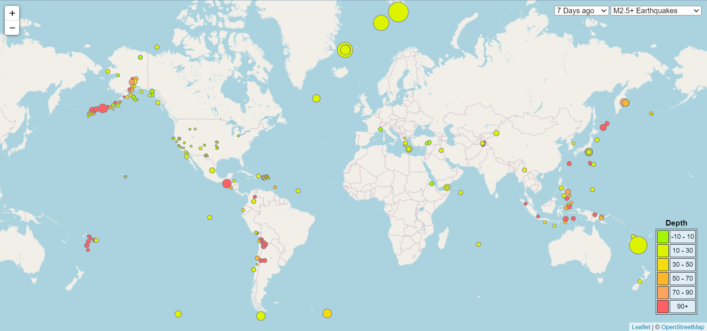

# Leaflet Challenge: Earthquake Map

## Dataset
- The USGS Earthquake database specific for Earthquakes in the last week over 2.5 magnitude.  
    - [USGS Website](https://earthquake.usgs.gov/earthquakes/feed/v1.0/geojson.php)  
    - [GeoJSON file address](https://earthquake.usgs.gov/earthquakes/feed/v1.0/summary/2.5_week.geojson)  
- OpenStreetMap tiles source:
    - [OpenStreetMap About Page](https://www.openstreetmap.org/about)

## Programming languages
- Javascript
- HTML
- CSS

## Libraries
- [Leaflet:](https://leafletjs.com/) For map visualization including tile layer, circle markers and legend
- [D3:](https://d3js.org/) For JSON calls to USGS API

## Results
_2.5+ Magnitude, 7 days_  

## Bonus
Added dropdown options for magnitude and timeframe to take advantage of USGS's different query options, it updates the map every time a new option is selected:  
  

Bonus example: _All Earthquakes, last 30 days_  
 